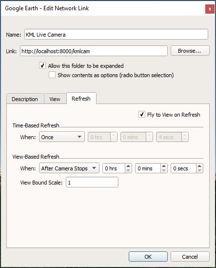
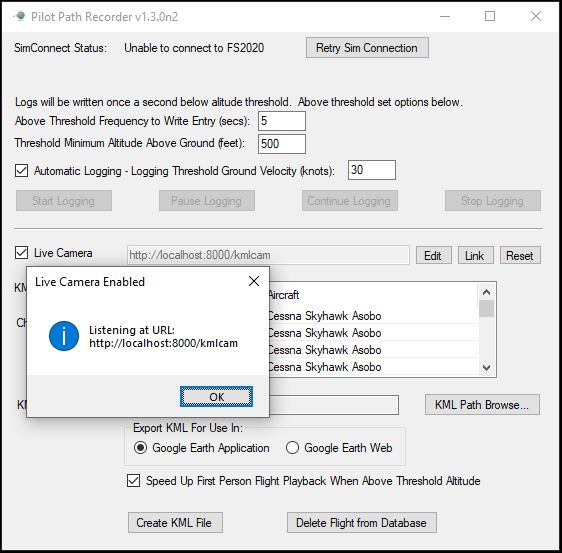

## KML "Live Camera"

### Description

You can configure a [Network Link] within Google Earth that will "call back"
to MSFS2020-PilotPathRecorder and reflect the current view in "real-time"
from the simulated airplane using a [KML Camera].

### Setup

In order to get this feature working, you must setup the Network Link
in Google Earth, as illustrated in the example below.  One way to do 
this is through Google Earth's menu item `Add >> Network Link`.

The configured Network Link should look something like this:

The important configuration items are:

- `Link` - points Google Earth to MSFS2020-PilotPathRecorder for the updated, "live camera view";

- `Refresh` - sets the frequency with which the updates will take place;
 
- `Fly to View on Refresh` - tells Google Earth to "fly" to the newly updated "camera" position

Of course, MSFS2020-PilotPathRecorder must be actively connected to the flight
simulator in order for this feature to work.

### Running

To start the live camera listener within MSFS2020-PilotPathRecorder, use the new
checkbox within the dialog.  If you must customize the URI used for the network
link, you can adjust that prior to starting the listener.  Note that this URI
value should correspond to the one you used for the "Network Link" within
Google Earth (see above).

Here's an example of what it might look like:

[KML Camera]: https://developers.google.com/kml/documentation/cameras
[Network Link]: https://developers.google.com/kml/documentation/updates