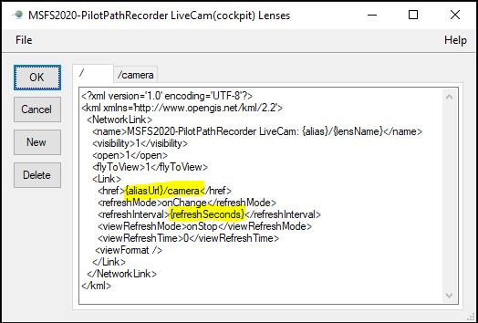

# LiveCam Support

## Description

A metaphor of a "Live Camera" (aka LiveCam) is used to describe a feature enabling real-time display
in Google Earth of a simulated flight.  Read below for details about this feature.

You can configure a [KML Network Link] to periodically "call back" to MSFS2020-PilotPathRecorder in order
to synchronize Google Earth's view with the simulator's view, in "real-time", using a [KML Camera]
or other KML markup.

In addition to using and/or extending the built-in LiveCams, it's possible to create your own using a
specialized, provided editor to define "Lens" (another metaphor) templates used to periodically generate
and deliver KML to Google Earth to synchronize its view with the simulation.

Notes:
1. As of this writing, this feature is only usable in the "desktop" version of "Google Earth"
1. See the [KML Tutorial] for some practical examples and ideas for setting up or customizing LiveCams,
   and the [KML Reference] for some gory details you'll likely need to understand

## Setup

See how to configure, enable and activate this MSFS2020-PilotPathRecorder feature by using Network Link(s)
within Google Earth, as explained below:

### MSFS2020-PilotPathRecorder

The "Live Camera" check box can be used to activate or deactivate this feature within MSFS2020-PilotPathRecorder.
While active, an internal, lightweight "web server" listens and responds to KML Network Link callbacks from
Google Earth for updates.

Here's an example of what it might look like right after being activated:


The link URL(s) of available LiveCams can be seen by opening the "Network Link" combo box,
located just to the right of the check box.

#### Anatomy of a Network Link URL

The following notations are used to reference the various types of URLs associated with
LiveCams:

- ***\{listenerUrl\}*** - the base URL endpoint exposed by the internal web server
  - the default is **`http://localhost:8000`**, but can be changed in the dialog, if needed
- ***\{liveCamUrl\}*** - the same as ***\{listenerUrl\}*****`/kmlcam`**
- ***\{aliasUrl\}*** - the same as ***\{liveCamUrl\}*****`/`*****\{alias\}***
- ***\{lensUrl\}*** - the same as ***\{aliasUrl\}*****`/`*****\{lens\}***
- ***\{query\}*** - the set of URL "query" parameters associated with any of the above 

Where:
- ***\{alias\}*** is the name of the LiveCam; if not specified, it's the empty string (i.e., "")
- ***\{lens\}*** names a specific KML generator for the LiveCam; if not specified, it's the
  empty string.  A LiveCam may use one or more "Lenses" in order to accomplish its goals.

Notes:
- The "Lens" whose name is the empty string will be delivered to Google Earth when
  the `Link` button (to the right of the combo box) is pressed.  This "link Lens"
  typically generates the initial Network Link KML, and is used as the way to install
  or activate a LiveCam within Google Earth.

#### Default And Customized LiveCams

Customization of built-in LiveCams, or creation of new LiveCams is made possible through the use of
the `Edit` button, just to the right of the "Network Link" combo box.  When pressed, here's what
you might see (with added highlighting of substitution tokens):



Each tab corresponds to a "Lens Template" used to generate the needed KML to be delivered to Google Earth
(tabs are named with a slash followed by the name of the Lens).  Lens templates reference one-another
through KML Network Link URLs they emit, as needed to accomplish their desired effect.  For example,
in the example template shown above, see how the `/` (initial link) template references the `/camera`
Lens template, which is then called periodically by Google Earth, according to `refreshMode`.

The set of values describing the real-time state of the simulated flight (such as airplane position,
heading, speed, bank angle, etc.) can be referenced by templates, albeit a bit differently depending
upon the template's language.  Supported template languages include:

- KML Templates - values are referenced using curly brace substitution tokens
- [Razor Pages] - values are referenced as standard `Model` variables
- [C# Script] - values are referenced as standard context variables

Examples of each type can be found in the built-in templates.

The template evaluation engine automatically determines a template's language based upon heuristics
such as looking at the first few characters of the template.

Use the `Reset` button (to the right of the "Network Link" combo box on the main dialog) to
restore a LiveCam to its "out of the box" state.

### Google Earth

Once the Live Camera feature is enabled in MSFS2020-PilotPathRecorder, the initial Network
Link for a LiveCam can be installed and/or activated within Google Earth, as illustrated in
the example below.  This can be done through using the `Link` button on the dialog (see above),
or manually within Google Earth.

Manual installation of a Network Link within Google Earth can be accomplished using the "Edit
Network Link" dialog within Google Earth (e.g., through its menu item `Add >> Network Link`.)
A configured Network Link should look something like this:


The important configuration items are:

- `Link` - points Google Earth to LiveCam's "update" Lens - that is, the defined LiveCam Lens
  that generates the periodic KML updates reflecting the real-time state of the simulation.

- `Refresh` - sets the frequency with which the updates will take place; the more frequent the
    update, the "smoother" should be the apparent "movement" of the aircraft within Google Earth.
    Either supported "Refresh Mode" can be used (i.e., refresh as soon as the previous refresh
    completes, or every so often...)
 
- `Fly to View on Refresh` - tells Google Earth to "fly" to the newly updated "camera" position;
    always use this if you want Google Earth's view to follow the aircraft's position.

Once properly activated, the Network Link is used to periodically refresh the view within Google
Earth to match the state of the simulation.

Should Google Earth be unable to reach the LiveCam via the Network Link for an extended period of
time, it may be necessary to manually "Refresh" it from within Google Earth to restore
synchronization once the link becomes reachable again.

### Examples

The ability to customize the KML "camera" and "link" templates encourages experimentation, and opens
up additional use cases.  Check out some examples below, for instance:

#### Moving Map with Custom Icon

Instead of showing the pilot's view from the simulated airplane cockpit, for example, you could use
the following "Camera Template" to display your airplane as a moving icon, as viewed from above:

```
<?xml version='1.0' encoding='UTF-8'?>
<kml
    xmlns = 'http://www.opengis.net/kml/2.2'
    xmlns:gx='http://www.google.com/kml/ext/2.2'
    xmlns:kml='http://www.opengis.net/kml/2.2'
    xmlns:atom='http://www.w3.org/2005/Atom'
>
  <Document>
    <Style id="planeIcon">
      <IconStyle>
        <scale>1.5</scale>
        <Icon>
          <href>
            https://findicons.com/files/icons/599/transport_for_vista/48/airplane.png
          </href>
        </Icon>
      </IconStyle>
    </Style>
    <Placemark>
      <name>Me</name>
      <description>Just flying around</description>
      <styleUrl>#planeIcon</styleUrl>
      <Point>
        <altitudeMode>absolute</altitudeMode>
        <coordinates>{longitude},{latitude},{altitude}</coordinates>
        <altitudeMode>absolute</altitudeMode>
      </Point>
    </Placemark>
  </Document>
</kml>
```

#### Other Ideas

There are potentially countless creative ways this experimental feature can be used to track your flight.
Check out what some other people are doing:

- [Relevant Excerpt: Google I/O 2011](https://www.youtube.com/watch?v=nIoWHlEEeNI&t=16m17s)

#### \<\<Your Idea Goes Here\>\>

If you come up with something interesting or that you'd like to share, please let us know!

[KML Camera]: https://developers.google.com/kml/documentation/cameras
[KML Reference]: https://developers.google.com/kml/documentation/kmlreference
[KML Tutorial]: https://developers.google.com/kml/documentation/kml_tut
[KML Network Link]: https://developers.google.com/kml/documentation/updates
[Razor Pages]: https://en.wikipedia.org/wiki/ASP.NET_Razor
[C# Script]: https://en.wikipedia.org/wiki/CS-Script