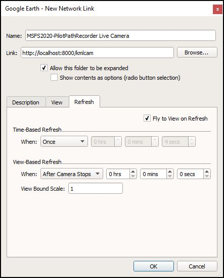

# KML "Live Camera"

## Description

You can configure a [Network Link] to periodically "call back" to MSFS2020-PilotPathRecorder in order
to synchronize Google Earth's view with the simulator's view, in "real-time", using a [KML Camera].

- _*Note: as of this writing, this feature is only usable in the "desktop" version of "Google Earth"*_

## Setup

Once this feature is enabled within MSFS2020-PilotPathRecorder, configure and activate the Network Link
within Google Earth, as described below:

### MSFS2020-PilotPathRecorder

The "Live Camera" checkbox can be used to enable or disable support for this feature
within MSFS2020-PilotPathRecorder.

Though the default value provided for the Network Link URI (e.g., `http://localhost:8000/kmlcam`)
should work in most cases, you can change it if necessary prior to enabling the feature.

- _Note: this URI value should correspond to the one used for the "Network Link" within
Google Earth (see below)._

Here's an example of what it might look like right after being enabled:

### Google Earth

Once the Live Camera is enabled in MSFS2020-PilotPathRecorder, the Network Link can be activated
within Google Earth, as illustrated in the example below.  One way to bring up the "Edit Network Link"
dialog within Google Earth is through its menu item: `Add >> Network Link`.

The configured Network Link should look something like this:

The important configuration items are:

- `Link` - points Google Earth to MSFS2020-PilotPathRecorder for the updated, "live camera view";

- `Refresh` - sets the frequency with which the updates will take place;
 
- `Fly to View on Refresh` - tells Google Earth to "fly" to the newly updated "camera" position

Once properly activated, the Network Link will periodically refresh the "Camera" view within
Google Earth to match the "straight ahead" view from within the simulator's cockpit.  

Should Google Earth be unable to reach MSFS2020-PilotPathRecorder's "Live Camera" through
the Network Link for an extended period of time, it may be necessary to manually "Refresh"
it from within Google Earth to restore synchronization once the link becomes reachable again.

[KML Camera]: https://developers.google.com/kml/documentation/cameras
[Network Link]: https://developers.google.com/kml/documentation/updates