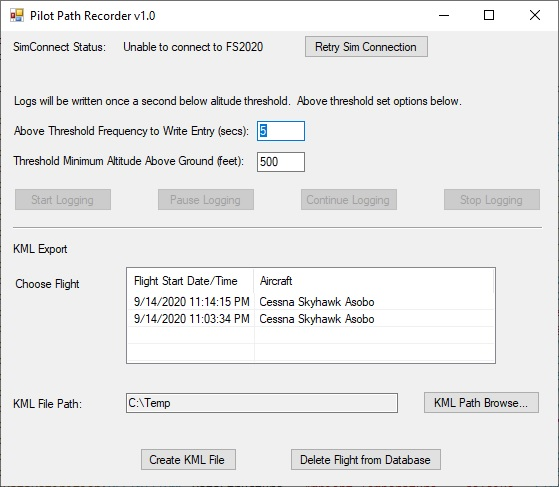

# MSFS2020-PilotPathRecorder
Record your flight path with key flight information archived during the trip.  Then export that data to a KML file to use with Google Earth for 3 dimensional flight analysis

This is a stand-alone application that must be run outside of Microsft Flight Simulator 2020.  Once run, this application allows the user to set various settings to control the recording and exporting experience

