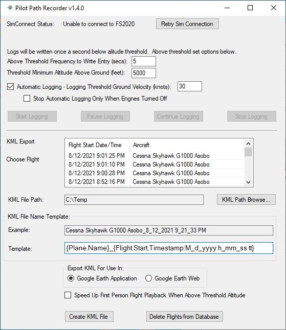
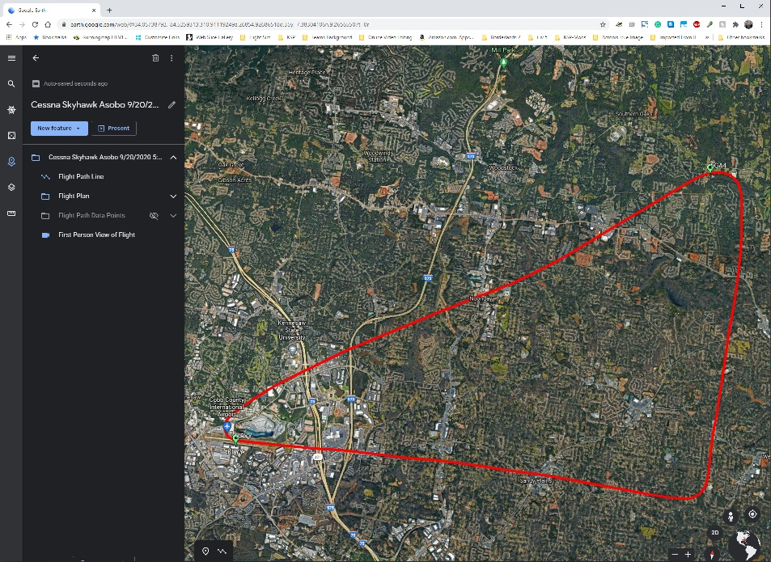
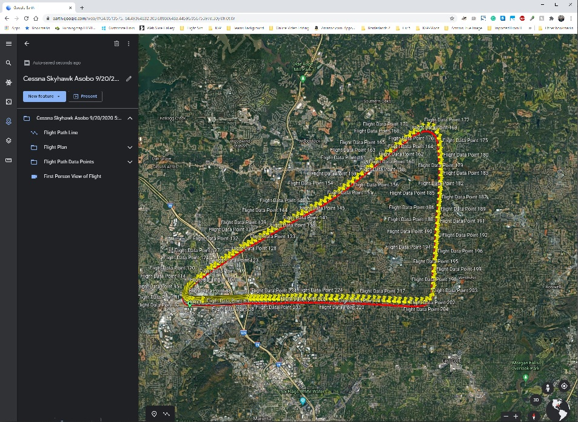
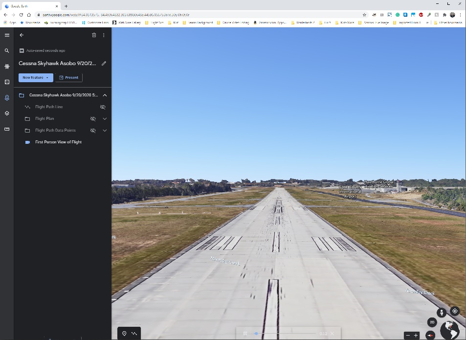

See farther down in this document for instructions on how to install and use the program.

Discussions Tab is turned on above, please use it to post questions, bugs, or enhancement ideas.

# MSFS2020-PilotPathRecorder
PilotPathRecorder is a replay and flight data capture tool that allows you to see your flight information visually using Google Earth. Record your flight path with key flight information archived during the trip.  Then the application will export that data to a KML file to use with Google Earth for 3 dimensional flight analysis, flight plan information and a chance to review your flight from the first person perspective.

This is a stand-alone application that is run outside of Microsft Flight Simulator 2020.  Once run, this application allows the user to set various settings to control the recording and exporting experience.  A database is used to store your flights so feel free to fly during one session and export in another.

# Version History
v1.4.0
- Added automatic connect, and reconnect, to MSFS.
- Added support for multiple flight delete from list (just use shift key to multi-select)
- Added support for multiple flight export from list (just use shift key to multi-select)
- Fixed issue where MSFS would sometimes return garbage characters for waypoint of a flight plan. These garbage waypoints are now renamed to "Unknown Waypoint"
- Fixed issue with some 3rd party planes that had characters that would cause a crash on KML export
- Added ability to use an airport within 2 miles from the start of the flight and 2 miles within the end of the flight as waypoints for flights that didn't have a flight plan created.
- Added support for a new option for automatic logging to only stop logging if engines were turned off.
- Added ability to customize the exported KML filename with key names. These key names must be surrounded by { }. The key names are as follows:
Plane.Name - the name of plane used in flight
Loc.Start.Ident - the ident of the closest airport at the start of the flight
Loc.End.Ident - the ident of the closest airport at the end of the flight
Loc.Start.Name - the name of the closest airport at the start of the flight
Loc.End.Name - the name of the closest airport at the end of the flight
Loc.Start.City - the city of the closest airport at the start of the flight
Loc.End.City - the city of the closest airport at the end of the flight
Loc.Start.State - the state of the closest airport at the start of the flight
Loc.End.State - the state of the closest airport at the end of the flight
Flight.Start.Timestamp:timeformat - the computer date/time at the start of the flight using timeformat as the format of date/time desired
Flight.End.Timestamp:timeformat - the computer date/time at the end of the flight using timeformat as the format of date/time desired
more details about timeformat can be found at https://docs.microsoft.com/en-us/dotnet/standard/base-types/custom-date-and-time-format-strings
Also, plain text and symbols can be used in the file name as well. Just type them in outside of { }

v1.3.0
- Added ability to automatically start and stop the recorder based on flight ground speed. This way you will never forget to log your flight.

Some more details: There is a new setting on the main page that allows you to turn on and off this feature (default is on) and also set the ground velocity to a specific value to your liking. Above that value, logging starts and below that value, it stops and the flight log is saved. You can still manually start, pause, continue, and stop logging as you did before.
Some rules about how manual and automatic logging work together. If you manually start logging then you must manually stop it. If you manually stop an automatically started log then once you go below the threshold speed and then above that speed again it will start an automatic log as a new flight. If you pause a log and then go below the threshold speed you must manually stop the log.

- Rewrote the logging subsystem for simplicity and to support automatic logging

v1.2.2
 - Fixed issue with FlightSampleDetails table create missing sim_on_ground column
 - Added database exception logging. The errors are now stored in a PilotPathRecorderLog.txt and a message is shown on the user interface if an exception occurs

v1.2.1 - Added ability for the application to check for updates

v1.2.0 - Added the ability to know if your plane is on the ground or in the air. Changed yellow push-pins on Flight Path Data Points to green meaning plane is on the ground or blue meaning plane is the air. This way people can zoom in on when their plane landed or took off and look at detail easier.

Note that previous flights recorded in the database assume plane is in the air the entire flight. Only new flights recorded will distinguish whether the plane is on the ground or in the air.

v1.1.1 - Fixed issue with pushpins where user would have to turn on every pushpin individually to show in Google Web application

 - Added First Person Flight View (fly your flight again in 1st person)
 - Thickened flight line
 - Added fight plan waypoints
 - Turned off data points showing in Google Earth by default
 - Turned on High DPI support for Windows 10.

v1.1.0
 - Added First Person Flight View
 - Thickened flight line
 - Added fight plan waypoints
 - turned off data points showing in Google Earth by default
 - General code cleanup

v1.0.3 - Fixed all issues related to international use of the program

## Instructions for use
Note that the Flight Simluator should be up and running before launching Pilot Path Recorder.  If not, then click Retry Sim Connection until you get the "SimConnect Connected" message.  Next choose the write frequency of how often to write to the database when above the minimum altitude threshold. Adjust the minimum altitude threshold as well.  For example if you want to write every 30 seconds when above ground by 5000 feet use the values 30 and 5000 respectfully.

There are two ways to log a fligth.  Automatic and manual.  For automatic ensure the "Automatic Logging is checked and set the appropriate ground speed.  Once the plane is above that speed logging will begin.  When it is below that speed logging will end and the flight will be recorded.  For manual logging, click 'Start Logging' when you are ready to start the recording.  You may pause at anytime using the pause function and continue logging when ready.  'Stop Logging' ends the recording for that flight.

Note for automatic logging you can still pause, continue and stop your loggging if you so desire.

When ready to export you flight, choose a flight (newest are on the top) and if needed pick a directory to store the KML file.  Click 'Create KML File' to export the data to a KML file in the location chosen. Be sure to choose whether you will be using Google Earth application or Google Earth Web to view your KML. There are a few differences between the applications that will hamper your experience if you use the application different than you chose when the KML file was exported. 

You may also keep your database clean and tidy by deleting a flight from the database.  

Once you have a KML file, you may either use Google Earth on the web (earth.google.com) or download and install Google Earth (https://www.google.com/earth/) for your computer.

If using Google Earth web do the follwing to load the KML file:
1. Click the Hamburger menu icon and pick projects
2. Click open and Import KML from computer.  
3. Find KML file and select it.  
Note to look at another KML file, you may want to click the trash icon on the current Flight Data to make the map less confusing

If using Google Earth application:
1.  Find the KML file on your computer and double-click or press enter to automatically start Google Earth and use this KML file

At this point you should see the path and flight plan if your flight involved one. Feel free to use normal Google Earth controls to look at your flight in 3 dimensions and zoom in and out.  To see more details about your flight, enable the 'Flight Path Data Points' layer by either clicking the eye icon (web version) or checkbox (Google Earth computer version).  Note that this layer is off by default each time your export from the PilotPathRecorder application.  With 'Flight Path Data Points' layer enabled you can see detailed information of the various flight paramters, click a pin to see what was going on at that particular moment of your flight.  With version 1.2.0 and beyond, the yellow pins are replaced with green pins meaning the plane is on the ground and blue pins meaning the plane is in the air. Note only flights recorded with version 1.2.0 or newer can distinguish a plane on the ground or in the air.  Earlier version recordings will always assume the plane is in the air.

Click on First Person View to review your flight from the first person perspective. You can use first person view with any of the other layers turned on or off.

## Instructions for install
1. Install .NET 4.7.2 - download can be found at https://dotnet.microsoft.com/download/dotnet-framework/net472

2. Download Pilot Path Recorder zip file from the releases area of this project: https://github.com/SAHorowitz/MSFS2020-PilotPathRecorder/releases

3. Unzip contents of Pilot Path Recorder to a directory

4. Launch FS2020PlanePath.exe to start Pilot Path Recorder
